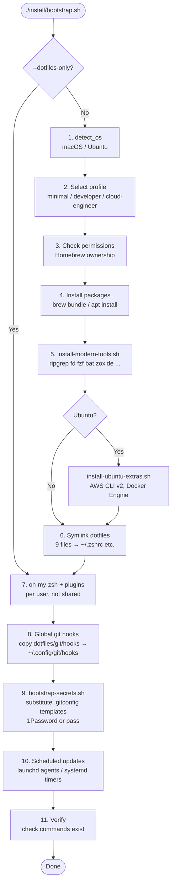
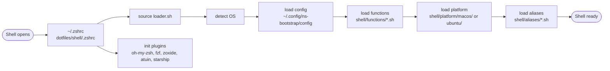
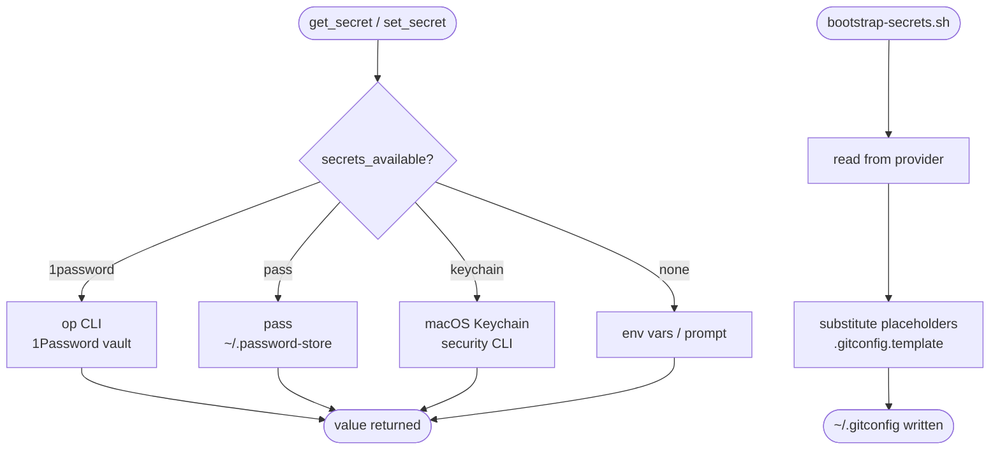

# ns-bootstrap Architecture

## High-Level Overview

```
┌─────────────────────────────────────────────────────────────────────┐
│                          ns-bootstrap                               │
│                                                                     │
│  Entry Point          Package Definitions       Runtime Shell       │
│  ─────────────        ──────────────────        ─────────────       │
│  install/             packages/                 shell/              │
│  bootstrap.sh   ───▶  Brewfile.{profile}        loader.sh     ◀─── │
│                        apt-packages.{profile}   functions/         │
│                        install-modern-tools.sh  aliases/           │
│                        install-ubuntu-extras.sh platform/          │
│                                                                     │
│  Dotfiles             Secrets                   Scheduled Updates   │
│  ────────             ───────                   ─────────────────   │
│  dotfiles/ ────▶ ~/   secrets/                  scripts/           │
│  symlinked            bootstrap-secrets.sh      launchd/ (macOS)   │
│                        ▼ 1Password / pass        systemd/ (Ubuntu)  │
│                        ~/.gitconfig                                 │
│                                                                     │
│  Git Hooks            CI                                            │
│  ─────────            ──                                            │
│  ~/.config/           .github/workflows/                           │
│  git/hooks/           lint.yml                                      │
│  (global)             bootstrap-test.yml                            │
│                        brew-check.yml                               │
└─────────────────────────────────────────────────────────────────────┘
```

---

## Bootstrap Execution Flow



---

## Shell Loading at Runtime



---

## Package Profiles

```
                  minimal
                 ┌────────────────────────────────────────┐
                 │ git vim tmux curl wget jq ripgrep fd   │
                 │ fzf bat btop htop rsync gnupg2 unzip   │
                 └────────────────────────────────────────┘
                          │
                 developer (inherits minimal)
                 ┌────────────────────────────────────────┐
                 │ Python (pyenv/mise) Go Ruby Node       │
                 │ Docker / OrbStack  AWS CLI v2          │
                 │ git-delta lazygit  shellcheck          │
                 └────────────────────────────────────────┘
                          │
                 cloud-engineer (inherits developer)
                 ┌────────────────────────────────────────┐
                 │ Terraform  Kubernetes (kubectl/helm)   │
                 │ Azure CLI  skopeo  yamllint            │
                 │ Wireshark  Trivy   gitleaks            │
                 └────────────────────────────────────────┘
```

---

## Dotfiles Symlink Map

```
Repo                              Home directory
────────────────────────────────  ─────────────────────────────────
dotfiles/shell/.zshrc         ──▶ ~/.zshrc
dotfiles/shell/.zprofile      ──▶ ~/.zprofile
dotfiles/vim/.vimrc           ──▶ ~/.vimrc
dotfiles/misc/.inputrc        ──▶ ~/.inputrc
dotfiles/tmux/.tmux.conf      ──▶ ~/.tmux.conf
dotfiles/npm/.npmrc           ──▶ ~/.npmrc
dotfiles/git/.gitignore_global──▶ ~/.gitignore_global
dotfiles/starship/starship.toml─▶ ~/.config/starship.toml
dotfiles/atuin/config.toml    ──▶ ~/.config/atuin/config.toml

Templates (not symlinked — processed by bootstrap-secrets.sh):
dotfiles/git/.gitconfig.template     ──▶ ~/.gitconfig
dotfiles/git/.gitconfig-work.template──▶ ~/.gitconfig-work
```

---

## Secrets System



**1Password structure (macOS):**
```
Vault: Personal
└── ns-bootstrap (Secure Note)
    ├── Git Personal  → name, email, signing_key
    ├── Git Work      → name, email, signing_key, repo_dir
    ├── Tokens        → homebrew_github
    └── Network       → backup_password
```

---

## Git Hooks (Defense-in-Depth)

```
Every commit on every repo
        │
        ▼
~/.config/git/hooks/          ← global (core.hooksPath)
├── pre-commit                ← gitleaks secret scan
├── prepare-commit-msg        ← strip AI trailers (early)
└── commit-msg                ← strip AI trailers (final)
        │
        │  (if project sets core.hooksPath)
        ▼
scripts/hooks/commit-msg      ← project-level strip
└── chains back ──────────────▶ ~/.config/git/hooks/commit-msg

AI tools stripped: Claude · Copilot · GPT · OpenAI · Anthropic
                   Gemini · Codeium · Cursor · Windsurf
```

---

## Two-Account macOS Setup

```
┌─────────────────────────┐    ┌─────────────────────────┐
│   Admin account (usr0)  │    │  Daily account (user0)  │
│                         │    │                         │
│  bootstrap.sh           │    │  bootstrap.sh           │
│  (full install)         │    │  --dotfiles-only        │
│                         │    │                         │
│  Owns Homebrew          │    │  No package install     │
│  Installs packages      │    │  Symlinks dotfiles      │
│  Runs launchd agents    │    │  Sets up secrets        │
│  System updates         │    │  Day-to-day dev work    │
└──────────┬──────────────┘    └────────────┬────────────┘
           │                               │
           └──────────┬────────────────────┘
                      │
                      ▼
          /Users/Shared/repositories/
          (ACL: staff group r/w, inherited)
          ├── ns-bootstrap/
          └── ... (all repos)
```

---

## Scheduled Updates

```
07:00 ─── update-brew-daily ─────────────────────────────────────────
          brew upgrade (formulae only, non-interactive)

07:30 ─── update-my-system ──────────────────────────────────────────
          In new tmux session (admin account only):
          ├── brew upgrade --greedy (casks)
          ├── mise upgrade
          ├── omz update
          ├── softwareupdate --list
          └── mas upgrade (App Store)

Platform agents:
  macOS  → ~/Library/LaunchAgents/com.ns-bootstrap.*.plist
  Ubuntu → ~/.config/systemd/user/ns-bootstrap-*.timer
```

---

## CI/CD

```
Push / PR ──▶ lint.yml
              ├── ShellCheck (all .sh files)
              ├── zsh -n (.zshrc, .zprofile)
              └── bats tests/

Fortnightly ─▶ bootstrap-test.yml
  Ubuntu matrix (3 profiles):
              ├── apt install + modern tools + dotfiles
              └── verify: git jq curl rg fd fzf bat

  macOS smoke:
              ├── bash -n / zsh -n (syntax)
              ├── bats tests/
              └── ./bootstrap.sh --dry-run --profile minimal

Monthly ────▶ brew-check.yml
              └── Validate all Brewfiles
```

---

## Directory Reference

```
ns-bootstrap/
├── install/
│   ├── bootstrap.sh              # Main entry point
│   ├── lib/common.sh             # Logging, OS detection
│   ├── common/install-modern-tools.sh
│   └── ubuntu/install-ubuntu-extras.sh
├── packages/
│   ├── Brewfile.{minimal,developer,cloud-engineer}
│   └── apt-packages.{minimal,developer,cloud-engineer}
├── dotfiles/
│   ├── shell/{.zshrc,.zprofile}
│   ├── git/{.gitconfig.template,.gitignore_global,hooks/}
│   ├── vim/.vimrc
│   ├── tmux/.tmux.conf
│   ├── starship/starship.toml
│   ├── npm/.npmrc
│   └── atuin/config.toml
├── shell/
│   ├── loader.sh
│   ├── functions/{aws,secrets,system,docker,network,ssh,...}.sh
│   ├── aliases/{general,modern-tools}.sh
│   └── platform/{macos,ubuntu}/
├── secrets/
│   └── bootstrap-secrets.sh
├── scripts/
│   ├── scheduled-update-{daily,interactive}.sh
│   ├── launchd/*.plist.template
│   ├── systemd/*.{service,timer}
│   └── hooks/commit-msg
├── tests/
│   ├── common.bats
│   └── symlink.bats
└── .github/workflows/
    ├── lint.yml
    ├── bootstrap-test.yml
    └── brew-check.yml
```
