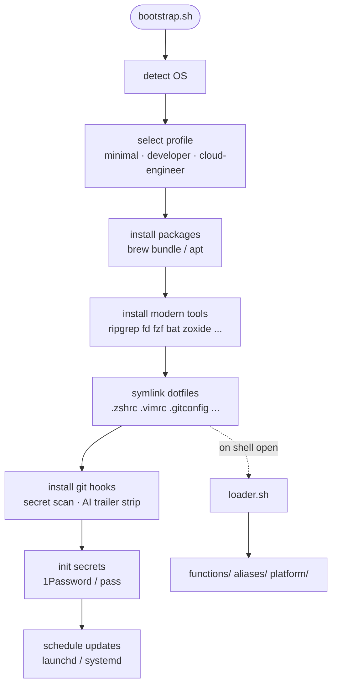

# ns-bootstrap

Cross-platform system bootstrap for macOS and Ubuntu 24.04, both using zsh.

## Table of Contents

- [Quick Start](#quick-start)
- [Profiles](#profiles)
- [Architecture](#architecture)
- [Structure](#structure)
- [Documentation](#documentation)
- [Secrets](#secrets)
- [Modern CLI Tools](#modern-cli-tools)
- [Shell](#shell)
- [macOS Initial Setup](#macos-initial-setup)
- [Platform Compatibility](#platform-compatibility)
- [License](#license)

## Quick Start

```bash
git clone https://github.com/ns408/ns-bootstrap.git ~/ns-bootstrap
cd ~/ns-bootstrap
./install/bootstrap.sh                  # Full install (admin)
./install/bootstrap.sh --dotfiles-only  # Dotfiles only (non-admin)
./install/bootstrap.sh --dry-run        # Preview what would be installed
```

## Profiles

| Profile | Includes |
|---------|----------|
| **minimal** | Core CLI tools, modern replacements (ripgrep, fd, fzf, bat, zoxide), browsers, utilities |
| **developer** | Minimal + languages (Python, Go, Ruby), Docker, OrbStack, AWS CLI, dev tools |
| **cloud-engineer** | Developer + Terraform, Azure CLI, Kubernetes, security tools, Wireshark |

## Architecture



See [.ai/ARCHITECTURE.md](.ai/ARCHITECTURE.md) for detailed diagrams covering profiles, secrets, git hooks, two-account setup, and CI.

## Structure

```
dotfiles/          # Config templates (.gitconfig, .zshrc, starship.toml, etc.)
shell/             # Functions, aliases, platform-specific scripts
packages/          # Brewfiles (macOS) and apt-packages (Ubuntu)
install/           # Bootstrap installer and tool scripts
secrets/           # Secrets management bootstrap
scripts/           # Scheduled updates, launchd/systemd agents
.ai/               # Project documentation and knowledge base
  CONTEXT.md       #   Project conventions and structure
  ARCHITECTURE.md  #   System architecture diagrams
  knowledge/       #   Domain knowledge (macOS, shell, security, etc.)
```

## Documentation

The `.ai/` directory contains structured project documentation and domain knowledge accumulated while building this repo:

| File | Topics |
|------|--------|
| [macos-admin.md](.ai/knowledge/macos-admin.md) | Two-account setup, launchd, Homebrew patterns, App Store CLI |
| [shell-cross-platform.md](.ai/knowledge/shell-cross-platform.md) | Bash/zsh portability, compinit, template variables |
| [secrets-management.md](.ai/knowledge/secrets-management.md) | 1Password structured items, pass, abstraction patterns |
| [scheduled-updates.md](.ai/knowledge/scheduled-updates.md) | launchd/systemd timers, tmux sessions, log management |
| [security-hardening.md](.ai/knowledge/security-hardening.md) | Git hooks, gitleaks, npm security, SSH signing |
| [modern-cli-tools.md](.ai/knowledge/modern-cli-tools.md) | Tool migration guide, fzf/atuin/mise integration |

## Secrets

Secrets are managed via 1Password CLI (macOS) or pass (Ubuntu). No secrets are stored in this repo.

```bash
source shell/functions/secrets.sh
get_secret "git/email-personal"
set_secret "github/token" "ghp_..."
```

## Modern CLI Tools

| Traditional | Modern | Description |
|-------------|--------|-------------|
| grep | ripgrep (`rg`) | Faster recursive search |
| find | `fd` | Simpler syntax, respects .gitignore |
| cat | `bat` | Syntax highlighting, line numbers |
| ls | `eza` | Colors, git status, tree view |
| cd | zoxide (`z`) | Jump by frecency |
| top | `btop` | Visual process/resource monitor |
| du | `dust` | Intuitive disk usage |
| diff | `delta` | Side-by-side git diffs |
| dig | `doggo` | DNS with DoH/DoT, colored output |
| curl | `httpie` | Human-friendly HTTP client |
| Ctrl+R | `atuin` | Full-text history search, cross-machine sync |

Run `modern-tools-help` for a full reference.

## Shell

Both macOS and Ubuntu use zsh with the same stack:

- **Framework:** Oh-My-Zsh (plugins, completions, git aliases)
- **Prompt:** Starship (Rust-based, cross-shell, context-aware)
- **History:** Atuin (SQLite-backed, fuzzy search, encrypted sync)
- **Enhancements:** zsh-autosuggestions, zsh-syntax-highlighting, fzf-tab

Ubuntu specifics: zsh is installed via apt and set as the default shell via `usermod`.
Dotfiles used: `dotfiles/shell/.zshrc.ubuntu` and `dotfiles/shell/.zprofile.ubuntu`
(same as macOS but without macOS-only plugins and with Linux PATH setup).

## macOS Initial Setup

### Two-Account Setup

This repo is designed for a two-account macOS workflow:

- **Admin account** — installs Homebrew packages, system updates, and privileged operations
- **Daily account** — non-admin, used for day-to-day development work

Shared files (repositories, data, configs) reside in `/Users/Shared` so both accounts can access them.

**Shared directory permissions** — Run once from the admin account to grant the `staff` group (which both accounts belong to) full read/write access with inheritance:

```bash
sudo chmod -R +a \
  "group:staff allow list,add_file,search,add_subdirectory,delete_child,readattr,writeattr,readextattr,writeextattr,readsecurity,file_inherit,directory_inherit" \
  /Users/Shared/repositories
```

**Bootstrap workflow:**

```bash
# 1. As admin account — full install (packages + dotfiles + secrets)
./install/bootstrap.sh

# 2. As daily account — dotfiles only (symlinks + oh-my-zsh + secrets)
./install/bootstrap.sh --dotfiles-only
```

### Scheduled Updates

Bootstrap installs daily scheduled update agents (launchd on macOS, systemd timers on Ubuntu):

| Schedule | What | Requires |
|----------|------|----------|
| 07:00 daily | `update-brew-daily` — Homebrew formulae only | No interaction |
| 07:30 daily | `update-my-system` — Casks, mise, omz, App Store, softwareupdate | tmux session (admin only) |

**Important:** You must be logged into the respective account via the macOS GUI (not via `su` or SSH) for the interactive update to work correctly. Some tools — notably `mas` (Mac App Store) and `softwareupdate` — require an active Aqua/GUI session. Running from a non-GUI context (e.g. `su - admin_user` from your daily account) may cause password prompts that block indefinitely or silently skip updates.

To run updates manually:

```bash
update-brew-daily    # Quick — formulae only
update-my-system     # Full — casks, mise, omz, softwareupdate list
update-macos-install # Manual — install macOS updates (may reboot)
```

### Hostname Configuration

```bash
YOUR_HOSTNAME="my-macbook-pro-m2"
sudo scutil --set HostName "$YOUR_HOSTNAME"
sudo scutil --set ComputerName "$YOUR_HOSTNAME"
sudo scutil --set LocalHostName "$YOUR_HOSTNAME"
```

### Essential System & Developer Setup

- **Update macOS:** `sudo softwareupdate -i -a --restart`
- **Xcode CLI Tools:** `xcode-select --install`
- **Trackpad/Mouse:** Adjust tracking speed, tap to click, natural scrolling
- **Keyboard:** Set key repeat rate, enable Full Keyboard Access
- **Finder:** Show all extensions and hidden files (`Cmd+Shift+.`)
- **Clear Dock:** `defaults write "com.apple.dock" "persistent-apps" -array && killall Dock`
- **Enable Firewall:** `sudo defaults write /Library/Preferences/com.apple.alf globalstate -int 1`
- **Enable FileVault:** `sudo fdesetup enable`
- **Disable Homebrew Analytics:** `brew analytics off`

## Platform Compatibility

| Platform | Architecture | Status |
|----------|-------------|--------|
| macOS (Apple Silicon) | ARM64 | Tested |
| Ubuntu 24.04 LTS | ARM64 | Tested (SSH) |
| macOS (Intel) | x86_64 | Expected to work, untested |
| Ubuntu 24.04 LTS | x86_64 | Expected to work, untested |

## License

[MIT](LICENSE)
